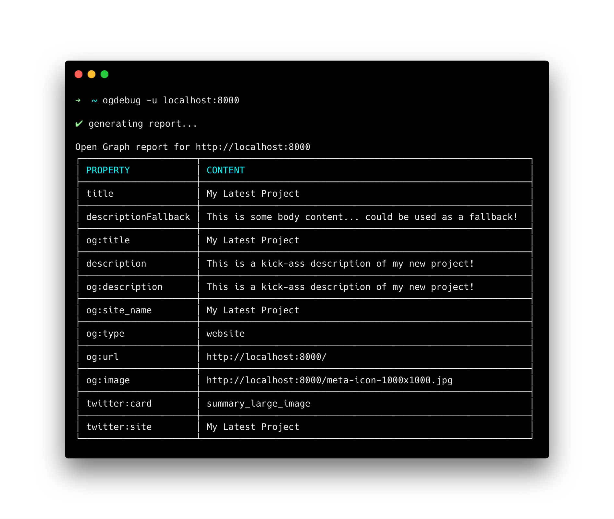

# ogdebug

Create Open Graph reports and sharing previews for sites running on your localhost (or not).



### Installation

```
npm i ogdebug -g
```

### Usage

```
ogdebug -u <url> [-V] [-s] [-p]
```

A report will be generated in your terminal (or browser with the `-V` flag).

Run `ogdebug -h` for a full list of options.

### License

MIT
